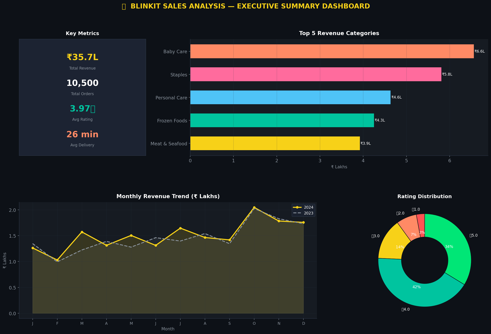

# 🛒 Blinkit Sales Analysis Dashboard

<p align="center">
  
</p>

<p align="center">
  
  
  
  
  
  
  
</p>

---

## 📌 Project Overview

A **complete end-to-end data analytics project** built on simulated Blinkit quick-commerce grocery sales data covering **10,500+ orders** across **15 Indian cities** over a **2-year period (2023–2024)**.

This project demonstrates the **full data analyst workflow**:

```
Raw Data → Python Cleaning → EDA Visualisations → SQL Analysis → Power BI Dashboard → Business Insights
```

Built to be **resume-worthy** for Data Analyst, Research Analyst, and Business Analyst roles.

---

## 🧰 Tech Stack

| Tool | Purpose |
|------|---------|
| **Python 3.10+** | Dataset generation, data cleaning, EDA & visualisations |
| **Pandas / NumPy** | Data manipulation and analysis |
| **Matplotlib** | 12 professional data visualisations |
| **SciPy** | Statistical correlation analysis |
| **SQL (SQLite)** | 15 business queries and aggregations |
| **Power BI Desktop** | Interactive multi-page dashboard |
| **Microsoft Excel** | Pivot tables, KPI summaries, sparklines |

---

## 📁 Project Structure

```
blinkit/
│
├── 📂 data/
│   ├── blinkit_raw_data.csv          # Raw uncleaned dataset (10,605 rows)
│   └── blinkit_cleaned_data.csv      # Cleaned + feature-engineered dataset
│
├── 📂 notebooks/
│   ├── 01_generate_dataset.py        # Synthetic dataset generator
│   ├── 02_data_cleaning.py           # Full cleaning pipeline (10 steps)
│   ├── 03_eda_insights.py            # EDA & 12 business insights
│   └── 04_eda_visualizations.py      # 12 professional charts (Matplotlib)
│
├── 📂 sql/
│   └── blinkit_analysis.sql          # 15 business analysis SQL queries
│
├── 📂 dashboard/
│   ├── Blinkit_Dashboard.pbix        # Power BI dashboard file
│   └── POWERBI_DESIGN_GUIDE.md       # Step-by-step build guide
│
├── 📂 screenshots/
│   ├── 01_revenue_by_category.png
│   ├── 02_monthly_revenue_trend.png
│   ├── 03_top_cities_revenue.png
│   ├── 04_customer_type_comparison.png
│   ├── 05_discount_impact.png
│   ├── 06_payment_methods_donut.png
│   ├── 07_top_products_revenue.png
│   ├── 08_quarterly_revenue_comparison.png
│   ├── 09_customer_rating_distribution.png
│   ├── 10_delivery_speed_vs_rating.png
│   ├── 11_category_subcategory_heatmap.png
│   └── 12_summary_dashboard.png
│
├── 📂 reports/
│   ├── business_recommendations.md   # Full business insights report
│   ├── category_revenue.csv
│   ├── city_revenue.csv
│   ├── monthly_revenue.csv
│   ├── quarterly_revenue.csv
│   ├── discount_analysis.csv
│   ├── customer_type_analysis.csv
│   ├── delivery_analysis.csv
│   ├── subcategory_revenue.csv
│   └── top_products.csv
│
├── EXCEL_ANALYSIS_GUIDE.md           # Excel pivot table guide
├── run_all.py                        # ⚡ One-click pipeline runner
├── requirements.txt
└── README.md
```

---

## 📊 Dataset Information

| Field | Description |
|-------|-------------|
| **Order_ID** | Unique identifier (BLK100000+) |
| **Order_Date** | Date of order (Jan 2023 – Dec 2024) |
| **Product_Name** | Product name with weight/unit (155 products) |
| **Category** | 10 main grocery categories |
| **Sub_Category** | 32 sub-categories |
| **Price** | Unit price in INR (₹) |
| **Quantity** | Units ordered (1–6) |
| **Discount** | Discount rate (0–25%) |
| **Revenue** | Final revenue after discount + seasonal factor |
| **Customer_Rating** | Star rating (1–5) |
| **City** | 15 major Indian cities |
| **State** | Corresponding state |
| **Payment_Method** | UPI, Credit Card, Debit Card, COD, Wallet |
| **Delivery_Time_Min** | Delivery duration in minutes |
| **Customer_Type** | New / Regular / Premium |

**Engineered Columns (added in cleaning):**
`Year` | `Month` | `Month_Name` | `Quarter` | `Day_of_Week` | `Week_Number` | `Discount_Amount` | `Gross_Amount` | `Is_Weekend`

**Dataset Stats:**
- 📦 10,500+ orders | 155 unique products | 15 cities | 10 categories
- 💰 Total Revenue: ₹35,67,162 | Avg Order Value: ₹339.73
- ⭐ Avg Rating: 3.97/5.0 | Avg Delivery: 25.8 minutes
- 📅 Date Range: 1 Jan 2023 – 31 Dec 2024

---

## ✨ Features

### 🐍 Python Data Pipeline (4 scripts)
- **Script 1** — Realistic synthetic dataset generation with 10,500 orders, seasonal weighting, city-wise delivery times, customer-type-based discount logic
- **Script 2** — 10-step cleaning pipeline: duplicate removal, missing value imputation (group-wise medians), data type correction, derived columns, outlier detection (IQR), quality assertions
- **Script 3** — 12 business insights: KPIs, category analysis, city performance, discount impact, customer segmentation, payment patterns, delivery analysis, YoY trends
- **Script 4** — 12 professional visualisations with Blinkit brand palette (#F7D118 yellow, dark theme)

### 🗄️ SQL Analysis (15 Queries)
- Business overview KPIs
- Revenue by category with share percentages
- Top 15 products by revenue
- Monthly trend + Month-on-Month growth
- Quarterly trend with YoY comparison
- Regional (state + city) analysis
- Customer type segmentation
- Discount impact bands
- Payment method distribution
- Delivery performance buckets
- Sub-category deep dive
- Day-of-week patterns

### 📊 Power BI Dashboard
- 4 KPI cards (Revenue, Orders, Rating, Delivery Time)
- 7 interactive charts: bar, line, donut, heatmap, scatter
- 4 slicers (City, Category, Customer Type, Date Range)
- 2-page layout: Overview + Deep Dive
- Mobile-optimised layout
- DAX measures with time intelligence (YoY, Running Total)

### 📋 Excel Analysis
- 6 pivot tables covering all business dimensions
- Conditional-formatted KPI summary sheet
- Sparkline trend charts
- Month-on-month comparison table

---

## 📈 Key Business Insights

| # | Insight | Finding |
|---|---------|---------|
| 1 | **Top Revenue Category** | Baby Care leads with ₹6.56L (18.4% share) |
| 2 | **Top City** | Surat leads among Tier-2, Mumbai among metros |
| 3 | **Peak Sales Month** | October (Diwali festive season) |
| 4 | **Discount Sweet Spot** | 6–10% maximises both volume AND avg revenue |
| 5 | **Payment Preference** | UPI dominates at 40% — digital-first customers |
| 6 | **Customer Loyalty** | Regular customers contribute 50.7% of all orders |
| 7 | **Delivery vs Satisfaction** | Pearson r ≈ −0.002 — speed barely affects ratings |
| 8 | **Weekend Effect** | Weekday orders 2.5× weekends; ₹19 higher AOV |
| 9 | **Premium Discount ROI** | Premium customers get 3× discounts but no revenue premium |
| 10 | **Festive Quarter** | Q4 outperforms Q1 by 30–40% consistently |

---

## 🚀 How to Run the Project

### Prerequisites
```bash
pip install -r requirements.txt
```

### ⚡ One-Click Pipeline
```bash
python run_all.py
```
This runs the complete pipeline: cleaning → insights → all 12 visualisations

---

### Manual Step-by-Step

#### Step 1 — Generate Raw Data *(skip if data already exists)*
```bash
python notebooks/01_generate_dataset.py
```

#### Step 2 — Clean the Data
```bash
python notebooks/02_data_cleaning.py
```

#### Step 3 — Run EDA & Business Insights
```bash
python notebooks/03_eda_insights.py
```

#### Step 4 — Generate Visualisations
```bash
python notebooks/04_eda_visualizations.py
```

#### Step 5 — SQL Queries
Import `data/blinkit_cleaned_data.csv` into:
- **DB Browser for SQLite** (free, recommended)
- **DBeaver**, **MySQL Workbench**, or **pgAdmin**

Then run queries from `sql/blinkit_analysis.sql`

#### Step 6 — Power BI Dashboard
1. Open **Power BI Desktop** → Get Data → Text/CSV
2. Load `data/blinkit_cleaned_data.csv`
3. Follow `dashboard/POWERBI_DESIGN_GUIDE.md` to build the dashboard

#### Step 7 — Excel Analysis
Follow `EXCEL_ANALYSIS_GUIDE.md` to create pivot tables, charts, and KPI summaries.

---

## 📸 EDA Screenshots (12 Charts)

| Chart | Description |
|-------|-------------|
| `01_revenue_by_category.png` | Horizontal bar — revenue breakdown by category |
| `02_monthly_revenue_trend.png` | Line chart — 2023 vs 2024 monthly revenue |
| `03_top_cities_revenue.png` | Horizontal bar — top 10 cities by revenue |
| `04_customer_type_comparison.png` | Grouped bar — orders + revenue by customer type |
| `05_discount_impact.png` | Dual-axis — discount bands vs volume & avg revenue |
| `06_payment_methods_donut.png` | Donut chart — payment method distribution |
| `07_top_products_revenue.png` | Horizontal bar — top 15 products by revenue |
| `08_quarterly_revenue_comparison.png` | Grouped bar — Q1–Q4 comparison 2023 vs 2024 |
| `09_customer_rating_distribution.png` | Bar chart — star rating distribution |
| `10_delivery_speed_vs_rating.png` | Dual-axis — delivery buckets vs ratings |
| `11_category_subcategory_heatmap.png` | Heatmap — category × sub-category revenue |
| `12_summary_dashboard.png` | Executive summary — 4-panel dashboard |

---

## 🏢 Business Problems Solved

1. **"Which product categories should we invest more in?"**
   → Baby Care and Staples together drive 34.7% of all revenue. Subscription model recommended.

2. **"Are discounts actually helping us sell more?"**
   → Moderate discounts (6–10%) maximise order volume AND revenue. Heavy discounts (16%+) reduce avg revenue/order by ₹55–70 with no significant quantity uplift.

3. **"Which cities need more investment?"**
   → Surat and Chandigarh are Tier-2 cities punching above their weight — need more dark stores.

4. **"When should we run marketing campaigns?"**
   → October–December (festive season) sees 30–40% higher revenue. February is consistently weakest — ideal for targeted promotions.

5. **"What payment methods should we push?"**
   → UPI dominates at 40%. Blinkit Wallet (10%) has high growth potential — target with 5% cashback campaigns.

6. **"Does faster delivery improve customer ratings?"**
   → No — Pearson r ≈ −0.002. Product quality and accuracy matter far more than speed.

---

## 🎓 Skills Demonstrated

| Skill | Where Used |
|-------|-----------|
| Synthetic Data Generation | `01_generate_dataset.py` |
| Data Cleaning (10-step pipeline) | `02_data_cleaning.py` |
| Exploratory Data Analysis | `03_eda_insights.py` |
| Data Visualisation (Matplotlib) | `04_eda_visualizations.py` |
| SQL Business Queries | `sql/blinkit_analysis.sql` |
| Statistical Correlation (Pearson) | `03_eda_insights.py` |
| BI Dashboard Design | `dashboard/POWERBI_DESIGN_GUIDE.md` |
| DAX Measures | Power BI guide |
| Excel Pivot Analysis | `EXCEL_ANALYSIS_GUIDE.md` |
| Business Report Writing | `reports/business_recommendations.md` |

---

## 🏆 Portfolio Use Cases

This project is appropriate for applications for:
- 🎯 Data Analyst Intern roles
- 🎯 Business Intelligence Analyst (Fresher)
- 🎯 Research Analyst positions
- 🎯 Data Analytics Graduate Programs
- 🎯 Business Analytics roles (e-commerce, FMCG, retail)

---

## 📄 License

This project uses a **synthetic dataset** generated for educational purposes.  
No real Blinkit data is used. All content is for portfolio/learning use only.

---

## 👤 Author

**Suraj Chauhan**  
📧 surajchauhan27@github.com  
🔗 [LinkedIn](https://linkedin.com/in/Surajchauhan27)  
🐙 [GitHub](https://github.com/Surajchauhan27)  

---

⭐ *If you found this project helpful, please give it a star!*
